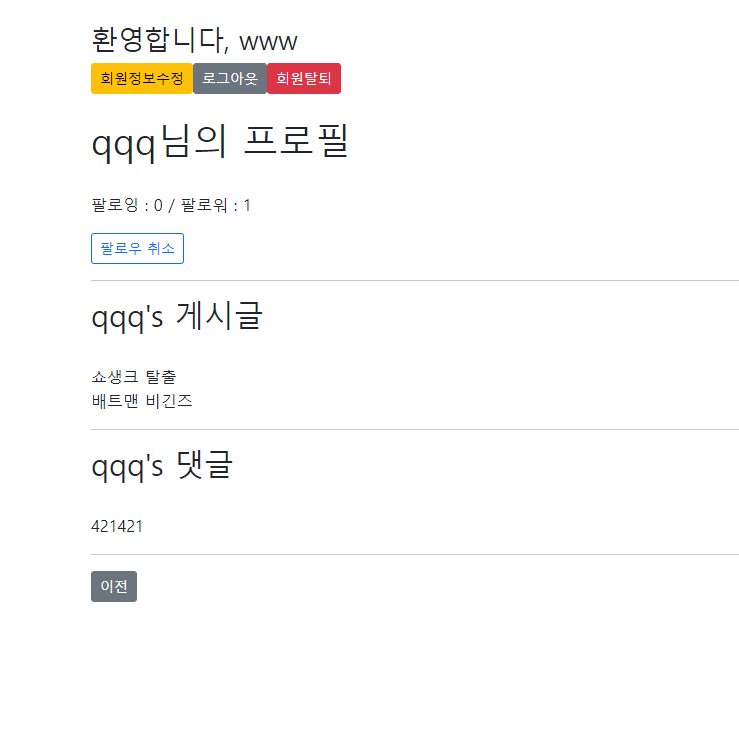
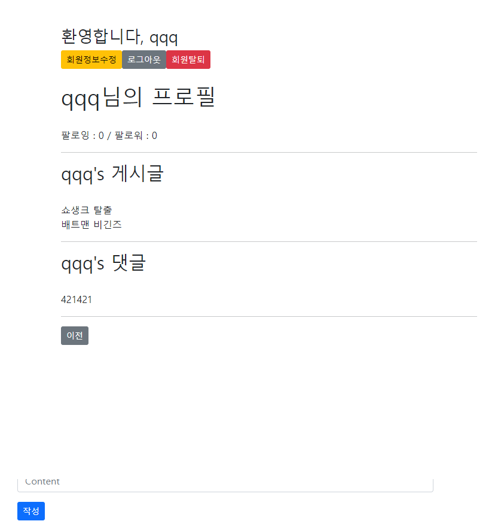

views.py
follow 함수
```py
@require_POST
def follow(request, user_pk):
    if request.user.is_authenticated:
        person = get_object_or_404(get_user_model(), pk=user_pk)
        if person.followers.filter(pk=request.user.pk).exists():
        # if request.user in person.followers.all():
            person.followers.remove(request.user)
        else:
            person.followers.add(request.user)
        return redirect('accounts:profile', person.username)
    return redirect('accounts:login')
```

models.py
```py
class User(AbstractUser):
    followings = models.ManyToManyField('self', symmetrical=False, related_name='followers')
```
profile.html
```py



<h1>{{ person.username }}님의 프로필</h1>
<br>
<div> 
  <p>
    팔로잉 : {{ person.followings.all|length }} / 팔로워 : {{ person.followers.all|length }}
  </p>
  
    <div>
      <form action="" method="POST">
        
        
          <button class="btn btn-outline-primary btn-sm">팔로우 취소</button>
        
          <button class="btn btn-primary btn-sm">팔로우</button>
        
      </form>
    </div>
    
</div>

<hr>

<h2>{{ person.username }}'s 게시글</h2>
<br>

	<!-- person.article_set & person.comment_set -->
	<div>{{ movie.title }}</div>


<hr>

<h2>{{ person.username }}'s 댓글</h2>
<br>

  <div>{{ comment.content }}</div>


<hr>

<a href="" class="btn btn-secondary btn-sm">이전</a>

```



