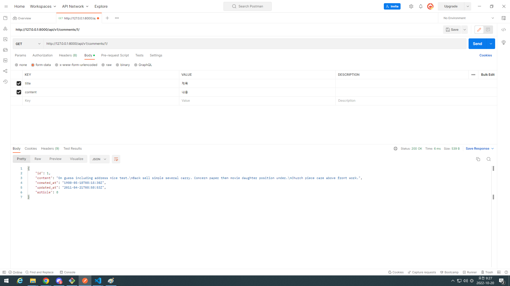

urls.py
```py
    path('comments/', views.comment_list),
    path('comments/<int:comment_pk>/', views.comment_detail),
```

views.py
```py
@api_view(['GET'])
def comment_list(request):
    if request.method == 'GET':
        # comments = Comment.objects.all()
        comments = get_list_or_404(Comment)
        serializer = CommentSerializer(comments, many=True)
        return Response(serializer.data)


@api_view(['POST'])
def comment_create(request, article_pk):
    # article = Article.objects.get(pk=article_pk)
    article = get_object_or_404(Article, pk=article_pk)
    serializer = CommentSerializer(data=request.data)
    if serializer.is_valid(raise_exception=True):
        serializer.save(article=article)
        return Response(serializer.data, status=status.HTTP_201_CREATED)

@api_view(['GET'])
def comment_detail(request, comment_pk):
    # comment = Comment.objects.get(pk=comment_pk)
    comment = get_object_or_404(Comment, pk=comment_pk)
    serializer = CommentSerializer(comment)
    return Response(serializer.data)
```

serializers.py
```py
class CommentSerializer(serializers.ModelSerializer):

    class Meta:
        model = Comment
        fields = '__all__'
        read_only_fields = ('article',)
```


