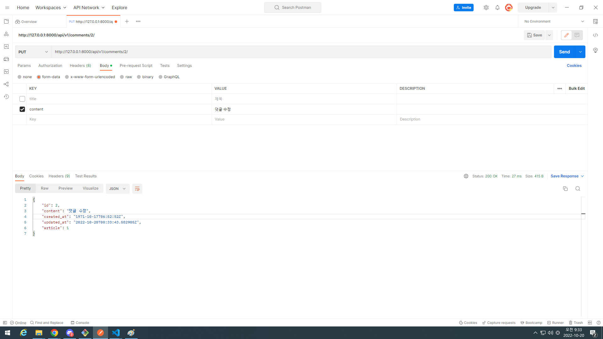
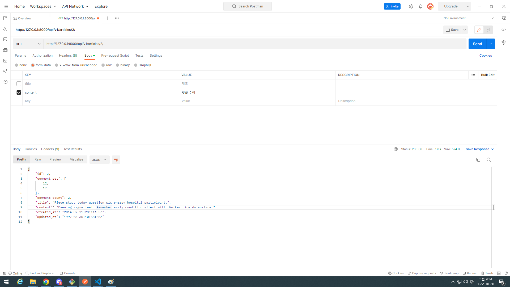
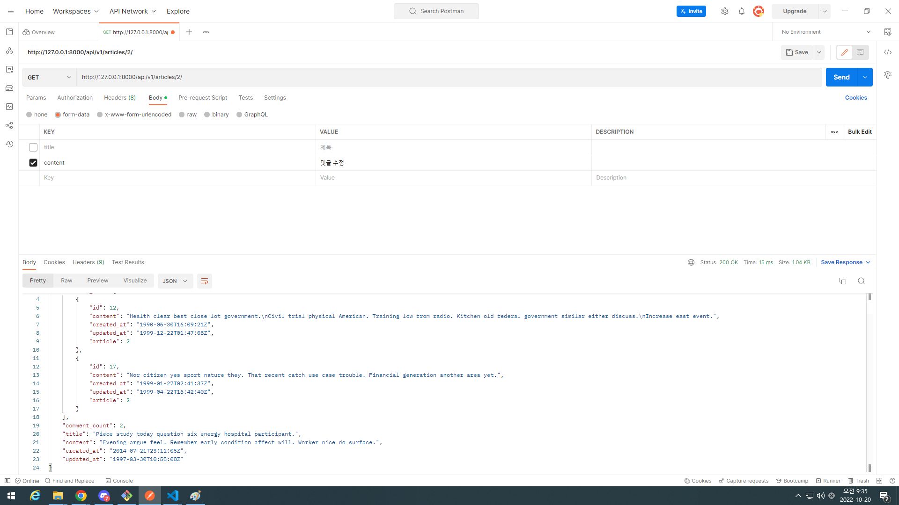

urls.py
```py
    path('articles/<int:article_pk>/comments/', views.comment_create),
```

views.py
```py
@api_view(['GET', 'DELETE', 'PUT'])
def comment_detail(request, comment_pk):
    # comment = Comment.objects.get(pk=comment_pk)
    comment = get_object_or_404(Comment, pk=comment_pk)

    if request.method == 'GET':
        serializer = CommentSerializer(comment)
        return Response(serializer.data)

    elif request.method == 'DELETE':
        comment.delete()
        return Response(status=status.HTTP_204_NO_CONTENT)

    elif request.method == 'PUT':
        serializer = CommentSerializer(comment, data=request.data)
        if serializer.is_valid(raise_exception=True):
            serializer.save()
            return Response(serializer.data)
```

serializers.py
```py
class ArticleSerializer(serializers.ModelSerializer):
    # comment_set = serializers.PrimaryKeyRelatedField(many=True, read_only=True)
    comment_set = CommentSerializer(many=True, read_only=True)
    comment_count = serializers.IntegerField(source='comment_set.count', read_only=True)

    class Meta:
        model = Article
        fields = '__all__'
```




